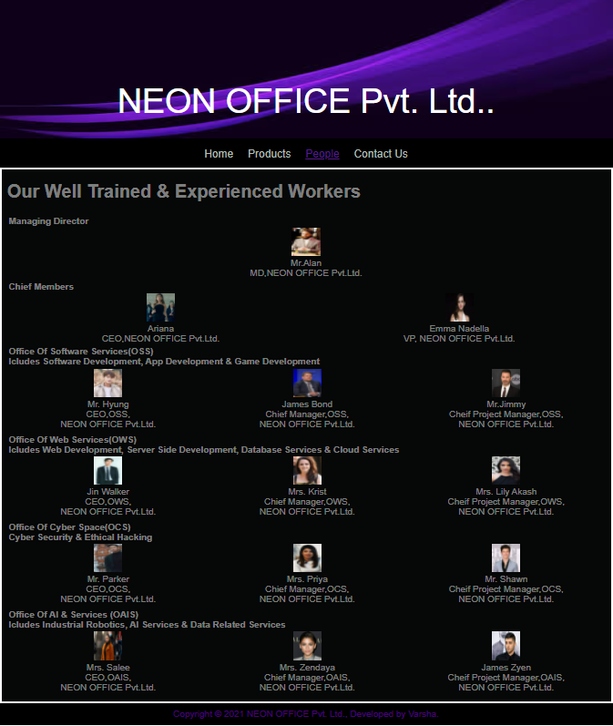

# Web Design for a Software Product Company

## AIM:

To design a static website for a software product company company.

## DESIGN STEPS:

### Step 1:

Requirement collection.

### Step 2:

Creating the layout using HTML and CSS.

### Step 3:

Updating the sample content.

### Step 4:

Choose the appropriate style and color scheme.

### Step 5:

Validate the layout in various browsers.

### Step 6:

Validate the HTML code.

### Step 6:

Publish the website in the given URL.

## PROGRAM :
```
    HOME PAGE:

<!DOCTYPE html>
<html lang="en">
  <head>
    <title>NEON OFFICE Pvt. Ltd.</title>
    <link rel="stylesheet" href="./css/layout.css" />
    <link rel="icon" href="./img/icon.png" type="image/x-icon" />
  </head>

  <body>
    <div class="container">
      <div class="banner">NEON OFFICE Pvt. Ltd.</div>
      <div class="menu">
        <div class="menuitemselected"><a href="/static/home.html">Home</a></div>
        <div class="menuitem"><a href="/static/products.html">Products</a></div>
        <div class="menuitem"><a href="/static/People.html">People</a></div>
        <div class="menuitem"><a href="/static/contact.html">Contact Us</a></div>
      </div>
      <div class="content">
        <div class="homecontent">
          <h1>About Us</h1>
          
          <div class="contenttext">
            Neon office was founded on oct 11, 1960, to develop and sell BASIC interpreters for the Altair 8800.
             It rose to dominate the personal computer operating system market with MS-DOS in the mid-1980s, 
             followed by Microsoft Windows. The company's 1986 initial public offering (IPO)
             ,
             <br/>
             and subsequent rise in its share price, created three billionaires and an estimated 12,000 millionaires among Microsoft employees. 
             Since the 1990s, it has increasingly diversified from the operating system market and has made a number of corporate acquisitions
             , their largest being the acquisition of LinkedIn for $26.2 billion in December 2016
             , followed by their acquisition of Skype Technologies for $8.5 billion in May 2011.
             <br/>

            As of 2015, Neon office is market-dominant in the IBM PC compatible operating system market and the office software suite market,
             although it has lost the majority of the overall operating system market to Android.
              The company also produces a wide range of other consumer and enterprise software for desktops, laptops, tabs, gadgets, and servers, including Internet search (with Bing),
               the digital services market (through MSN), mixed reality (HoloLens), cloud computing (Azure), and software development.
            <br />
            Our new product  takes laptops this to a new level, making your
            start to automation, or your switch to Tally simpler than ever
            before. You can now discover the product much more easily and make
            the product do more for you, without learning anything new. There is
            greater flexibility as the product adapts to your business and your
            way of working. And the transformed look and feel will only make you
            love the product even more.
            <ul>
              <li>Simple to learn, easier to use</li>
              <li>Insightful , actionable & customizable reports</li>
              <li>Anywhere, anytime and secure access</li>
            </ul>
          </div>
        </div>
      </div>
      <div class="footer">
        Copyright &#169; 2021 NEON OFFICE Private Limited, Developed by Varsha.      
      </div>
    </div>
  </body>
</html>

    PRODUCT PAGE:

<!DOCTYPE html>
<html lang="en">
  <head>
    <title>NEON OFFICE Pvt. Ltd.</title>
    <link rel="stylesheet" href="./css/layout.css" />
    <link rel="icon" href="./img/icon.png" type="image/x-icon" />
  </head>

  <body>
    <div class="container">
      <div class="banner">NEON OFFICE Pvt. Ltd.</div>
      <div class="menu">
        <div class="menuitem"><a href="/static/home.html">Home</a></div>
        <div class="menuitemselected">
          <a href="/static/products.html">Products</a>
        </div>
        <div class="menuitem"><a href="/static/people.html">People</a></div>
        <div class="menuitem"><a href="/static/contact.html">Contact Us</a></div>
      </div>
      <div class="content">
        <div class="productcontent">    
          <h1>Our Premium Products</h1>
          <div class="productitems">
              <div class="productitem"> 
                  <div class="itemimage">
                  
                  </div>
                  <div class="itemname">Dell G15</div>
                  <div class="itemprice">Price: Rs.1,06,000.00 </div>
              </div>
              <div class="productitem"> 
                  <div class="itemimage">
                  
                  </div>
                  <div class="itemname">Dell Vostro</div>
                  <div class="itemprice">Price: Rs.57,000.00 </div>
              </div>
              <div class="productitem"> 
                <div class="itemimage">
                
                </div>
                <div class="itemname">Dell Inspiron 14</div>
                <div class="itemprice">Price: Rs.68,000.00 </div>
              </div> 
              <div class="productitem"> 
                <div class="itemimage">
                
                </div>
                <div class="itemname">HP PAVILION 15</div>
                <div class="itemprice">Price: Rs.72,999.00 </div>
              </div>
              <div class="productitem"> 
                <div class="itemimage">
                
                </div>
                <div class="itemname">HP 15</div>
                <div class="itemprice">Price: Rs.45,000.00 </div>
              </div>
              <div class="productitem"> 
                <div class="itemimage">
                
                </div>
                <div class="itemname">Leveno tinnkpad 1430</div>
                <div class="itemprice">Price: Rs.40,000.00 </div>
              </div>
              <div class="productitem"> 
                <div class="itemimage">
                
                </div>
                <div class="itemname">Leveno ideapad 330</div>
                <div class="itemprice">Price: Rs.54,000.00 </div>
              </div>
              <div class="productitem"> 
                <div class="itemimage">
                
                </div>
                <div class="itemname">Apple MacBook Pro</div>
                <div class="itemprice">Price: Rs.2,39,999.00 </div>
              </div>
              <div class="productitem"> 
                <div class="itemimage">
                
                </div>
                <div class="itemname">Apple MacBook Air</div>
                <div class="itemprice">Price: Rs.84,000.00 </div>
              </div>
              <div class="productitem"> 
                <div class="itemimage">
                
                </div>
                <div class="itemname">Apple MacBook Air 2020</div>
                <div class="itemprice">Price: Rs.92,990.00 </div>
              </div>
              <div class="productitem"> 
                <div class="itemimage">
                
                </div>
                <div class="itemname">Apple MacBook Pro MVVK2LL</div>
                <div class="itemprice">Price: Rs.1,95,999.00 </div>
              </div>
              <div class="productitem"> 
                <div class="itemimage">
                
                </div>
                <div class="itemname">Apple MacBook Air 2</div>
                <div class="itemprice">Price: Rs.96,999.00 </div>
              </div>  
          </div>
          </div>        
      </div>
      <div class="footer">
        Copyright &#169; 2021 NEON OFFICE Pvt. Ltd., Developed by Varsha.
      </div>
    </div>
  </body>
</html>

    PEOPLE PAGE:

<!DOCTYPE html>
<html lang="en">
  <head>
    <title class="companyname">NEON OFFICE Pvt. Ltd.</title>
    <link rel="stylesheet" href="./css/layout.css" />
    <link rel="icon" href="./img/icon.png" type="image/x-icon" />
    <style>
          .td{
        width: 100%; 
        border: 0px;
        text-align: center;
        }
        .td2{
            width: 50%;
        text-align: center;
        padding-left: 5px;
        padding-bottom: 5px;
        }
        .td3{
            width: 33%;
        text-align: center;
        padding-left: 5px;
        padding-bottom: 5px;
        }
        img{
            height: 50px;
            width: 50px;
        }
    </style>
  </head>

  <body>
    <div class="container">
      <div class="banner">NEON OFFICE Pvt. Ltd..</div>
      <div class="menu">
        <div class="menuitem"><a href="/static/home.html">Home</a></div>
        <div class="menuitem"><a href="/static/products.html">Products</a></div>
        <div class="menuitemselected"><a href="/static/people.html">People</a></div>
        <div class="menuitem"><a href="/static/contactus.html">Contact Us</a></div>
      </div>
      <div class="content">
      <div class="content">
        <div class="productcontent">    
          <h1>Our Well Trained & Experienced Workers</h1>
          <div class="productitems">
            <table class="td">
              <th style="text-align: left;">Managing Director</th>
              <tr class="td1">
                <td>
                  </br>
                  Mr.Alan</br>
                  MD,NEON OFFICE Pvt.Ltd.
                </td>
          </table>
              <table class="td">
                  <th style="text-align: left;">Chief Members</th>
              <tr class="td2">
                <td>
                  </br>
                  Ariana</br>
                  CEO,NEON OFFICE Pvt.Ltd.
                </td>
                <td>
                  </br>
                  Emma Nadella</br>
                  VP, NEON OFFICE Pvt.Ltd.
                </td>
              <table class="td">
                  <th colspan="3" style="text-align: left;">Office Of Software Services(OSS)<br>Icludes Software Development, App Development & Game Development</th>
                  <tr>
                    <td class="td3">
                      </br>
                      Mr. Hyung</br>
                      CEO,OSS,</br> NEON OFFICE Pvt.Ltd.
                    </td>
                    <td class="td3">
                      </br>
                      James Bond</br>
                      Chief Manager,OSS,</br> NEON OFFICE Pvt.Ltd.
                    </td>
                    <td class="td3">
                      </br>
                      Mr.Jimmy</br>
                      Cheif Project Manager,OSS,</br> NEON OFFICE Pvt.Ltd.
                    </td>
                  </tr>
            </table>
            <table class="td">
              <th colspan="3" style="text-align: left;">Office Of Web Services(OWS)<br>Icludes Web Development, Server Side Development, Database Services & Cloud Services</th>
              <tr>
                <td class="td3">
                  </br>
                  Jin Walker</br>
                  CEO,OWS,</br> NEON OFFICE Pvt.Ltd.
                </td>
                <td class="td3">
                  </br>
                  Mrs. Krist</br>
                  Chief Manager,OWS,</br> NEON OFFICE Pvt.Ltd.
                </td>
                <td class="td3">
                  </br>
                  Mrs. Lily Akash</br>
                  Cheif Project Manager,OWS,</br> NEON OFFICE Pvt.Ltd.
                </td>
              </tr>
        </table>
        <table class="td">
          <th colspan="3" style="text-align: left;">Office Of Cyber Space(OCS)<br>Cyber Security & Ethical Hacking</th>
          <tr>
            <td class="td3">
              </br>
              Mr. Parker</br>
              CEO,OCS,</br> NEON OFFICE Pvt.Ltd.
            </td>
            <td class="td3">
              </br>
              Mrs. Priya</br>
              Chief Manager,OCS,</br> NEON OFFICE Pvt.Ltd.
            </td>
            <td class="td3">
              </br>
              Mr. Shawn</br>
              Cheif Project Manager,OCS,</br> NEON OFFICE Pvt.Ltd.
            </td>
          </tr>
    </table>
    <table class="td">
      <th colspan="3" style="text-align: left;">Office Of AI & Services (OAIS)<br>Icludes Industrial Robotics, AI Services & Data Related Services</th>
      <tr>
        <td class="td3">
          </br>
          Mrs. Salee</br>
          CEO,OAIS,</br> NEON OFFICE Pvt.Ltd.
        </td>
        <td class="td3">
          </br>
          Mrs. Zendaya</br>
          Chief Manager,OAIS,</br> NEON OFFICE Pvt.Ltd.
        </td>
        <td class="td3">
          </br>
          James Zyen</br>
          Cheif Project Manager,OAIS,</br> NEON OFFICE Pvt.Ltd.
        </td>
      </tr>
</table>
              </div>
          </div>
          </div>        
      </div>
      <div class="footer">
        Copyright &#169; 2021 NEON OFFICE Pvt. Ltd., Developed by Varsha.
      </div>
    </div>
  </body>
</html>

    CONTACT US PAGE:

<!DOCTYPE html>
<html lang="en">
  <head>
    <title class="companyname">NEON OFFICE Pvt. Ltd.</title>
    <link rel="stylesheet" href="./css/layout.css" />
    <link rel="icon" href="./img/icon.png" type="image/x-icon" />
  </head>

  <body>
    <div class="container">
      <div class="banner">NEON OFFICE Pvt. Ltd.</div>
      <div class="menu">
        <div class="menuitem"><a href="/static/home.html">Home</a></div>
        <div class="menuitem"><a href="/static/products.html">Products</a></div>
        <div class="menuitem"><a href="/static/people.html">People</a></div>
        <div class="menuitemselected"><a href="/static/contactus.html">Contact Us</a></div>
      </div>
      <div class="content">
        <div class="productcontent">    
          <h1>Contact Us</h1>
          <h2>NEON OFFICE Pvt. Ltd.</h2>
          <table width="100%" border="0" cellspacing="0" cellpadding="0">
            <tr>
              <td width="33%" valign="top">
                          <p>
                            <i>
                              <strong>Corporate & Registered Office</strong></i></p>
                              <p>NEON OFFICE Pvt. Ltd.<br />
                               #92, NEON Towers<br />
                               3rd & 4th Floor, Genesis Main Road,  <br/>
                               Genesis Nagar</br>
                               Chennai - 600 024<br />
                               Tamilnadu, India.<br /><br />
                               Phone: +91-95486 54514<br />
                               Tel: 044-4257-4664<br />
                               e-mail:<a target='_blank' href='mailto:info@genesissoftpvtltd.com?Subject=Enquiry for Genesis Software Pvt.Ltd.'> info@genesissoftpvtltd.com</a><br />
                              </p><br />
                </td>
              <td width="33%" valign="top">
              
               <p><strong>Training& Development Centre Genesis Ltd.</strong><br/> 
                    <p>NEON OFFICE Pvt. Ltd.<br />
                     #92, NEON OFFICE Towers<br />
                     8th, 9th & 10th  Floor, Genesis Main Road,  <br/>
                     Genesis Nagar</br>
                     Chennai - 600 024<br />
                     Tamilnadu, India.<br /><br />
                     Phone: +91-95486 54528<br />
                     Tel: 044-4257-4454<br />
                     e-mail:<a target='_blank' href='mailto:training@genesissoftpvtltd.com?Subject=Enquiry for Training & Development @ Genesis Software Pvt.Ltd.'> tandd@genesissoftpvtltd.com</a><br />
                    </p><br />
      </td>
              <td width="33%" valign="top">
              
               <p><strong>Media  & Investor Relations</strong><br/> <p> 
                                        
                                         <p><strong>Satya Nadella</strong> <br/>Vice President<p> 
                                         <p>NEON OFFICE Pvt. Ltd.<br />
                                          #92, NEON OFFICE Towers<br />
                                          2nd Floor, Genesis Main Road,  <br/>
                                          Genesis Nagar</br>
                                          Chennai - 600 024<br />
                                          Tamilnadu, India.<br /><br />
                                          Phone: +91-95486 54249<br />
                                          Tel: 044-4257-4578<br />
                                          e-mail:<a target='_blank' href='mailto:media@genesissoftpvtltd.com?Subject=Enquiry for Media and Related @ Genesis Software Pvt.Ltd.'> media@genesissoftpvtltd.com</a><br />
                                         </p><br />
                           </td>
            </tr>
          </table>
        </div>
      </div>
      <div class="footer">
        Copyright &#169; 2021 , Developed by NEON OFFICE Pvt. Ltd., Varsha.
      </div>
  </body>
</html>

    CSS WORKSHEET:

* {
  box-sizing: border-box;
  font-family: Arial, Helvetica, sans-serif;
}
body {
  background-color: whitesmoke;
  color: #ffffff7a;
}
.container {
  width: 1080px;
  margin-left: auto;
  margin-right: auto;
  border-width: 1px 1px 1px 1px;
  border-style: solid;
  box-shadow: 15px 15px 8px gray;
}

.banner {
  display: block;
  width: 100%;
  height: 250px;
  text-align: center;
  font-size: 60px;
  background-image: url("/static/img/images.jpg");
  background-size: 100% 100%;
  margin: 0px 0px 0px 0px;
  padding-top: 150px;
  color: #ffffff;
}

.menu {
  display: block;
  width: 100%;
  height: 50px;
  font-size: larger;
  background-color: #000000;
  text-align: center;
  padding-top: 15px;
  margin: 0px 0px 0px 0px;
  border-width: 1px;
}

.menuitem {
  display: inline-block;
  margin-left: 10px;
  margin-right: 10px;
}
.menuitemselected {
  display: inline-block;
  margin-left: 10px;
  margin-right: 10px;
  color: #000000;
}

.menuitem a {
  text-decoration: none;
  color: #B2BEB5
  ;
}

.content {
  display: block;
  width: 100%;
  background-color: #060707;
  min-height: 500px;
  margin: 0px 0px 0px 0px;
  border-width: 1px;
  border-color: white;
  border-style: solid;
}
.homecontent {
  min-height: 500px;
  margin: 10px 10px 10px 10px;
}
.homecontent h1 {
  text-align: left;
}
.homecontent img {
  float: right;
  width: 400px;
  height: 300px;
  margin-left: 10px;
}

.contenttext {
  text-align: justify;
}

.productcontent {
  min-height: 500px;
  margin: 10px 10px 10px 10px;
}

.productcontent h1 {
  text-align: left;
}

.productitems {
  display: block;
}

.productitem {
  display: inline-block;
  width: 30%;
  height: 250px;
  text-align: center;
}

.productitem img {
  width: 100px;
  height: 100px;
  display: block;
}
.productitem .itemimage {
  display: block;
  margin-left: auto;
  margin-right: auto;
  width: 100px;
  margin-bottom: 5px;
}

.productitem .itemname {
  display: block;
}
.productitem .itemprice {
  display: block;
}

.footer {
  display: block;
  width: 100%;
  height: 40px;
  background-color: #000000;
  text-align: center;
  padding-top: 10px;
  margin: 0px 0px 0px 0px;
  color: #9d07f573;
}
```


## OUTPUT:


6

### Home Page:


## Result:

Thus a website is designed for the software product company and the HTML,CSS code are validated.
